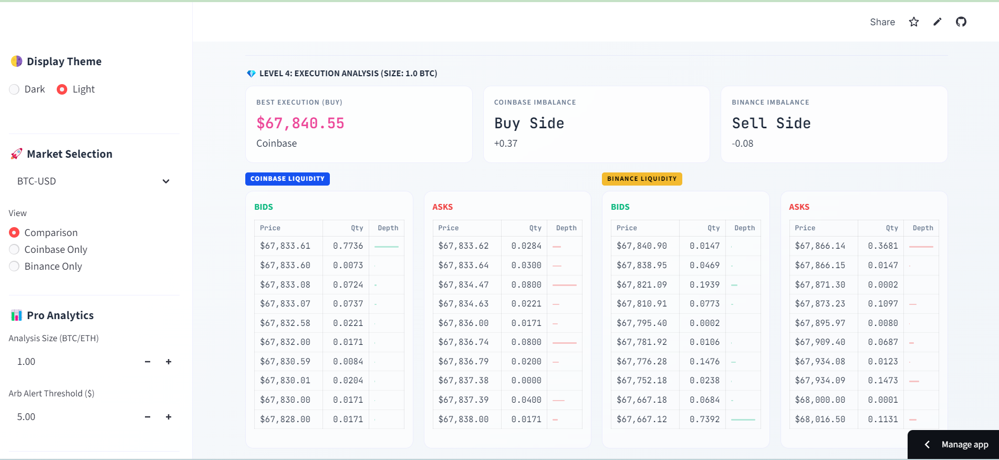
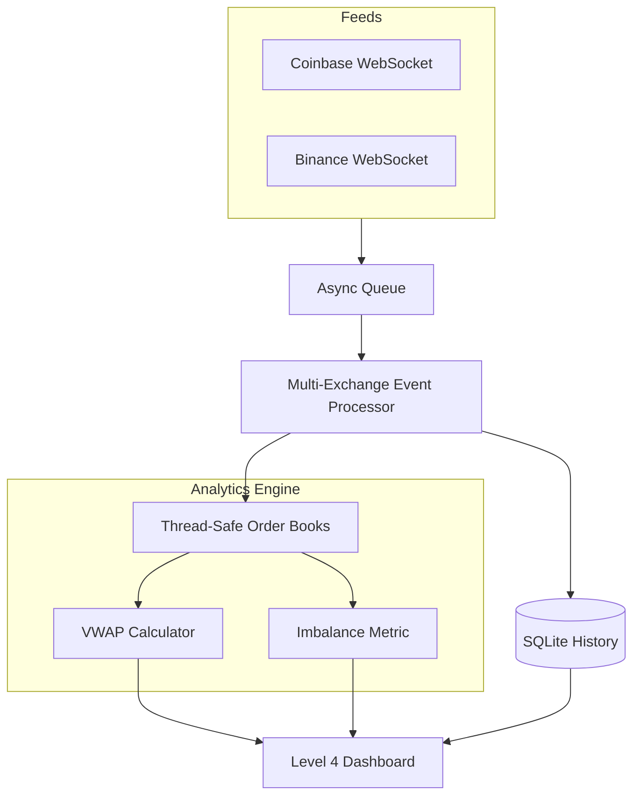

# Cross-Exchange Liquidity Engine

A high-performance, real-time cryptocurrency order book engine that aggregates liquidity from **Coinbase** and **Binance**. Built with Python, `asyncio`, and `websockets` for sub-100ms data ingestion.

## 🚀 Level 4 — Pro Analytics & Theme Flow (Current)

The engine has graduated to a professional-grade trading terminal with execution analysis and deep market metrics.

### Dashboard Overview (Level 4)

#### Premium Dark Mode

*VWAP Analysis, Liquidity Imbalance, and Real-time Alerts*

#### Clean Light Mode


*Professional day-time interface with consistent branding and readability.*

### Key Features

- **VWAP Execution Analysis** — Calculate effective buying/selling prices for custom order sizes by "walking the book".
- **Liquidity Imbalance Indicator** — Measure market pressure (ratio of bids vs asks) to anticipate price moves.
- **Dynamic Theme Flow** — Instant switching between **Dark** and **Light** modes via sidebar toggle.
- **Multi-Exchange Sync** — Real-time streaming from Coinbase Advanced Trade and Binance (Global/US).
- **Arbitrage Trend Charting** — Live visual tracking of price gaps with persistent SQLite logging.
- **Smart Alerts** — Visual highlighting for arbitrage opportunities based on refined price thresholds.

---

## 🏗️ Architecture



### Quick Start

```bash
# Install dependencies
pip install -r requirements.txt

# Run the pro dashboard
python -m streamlit run app.py

# Run tests
pytest tests/ -v
```

### Project structure

```
├── app.py                      # Streamlit entry point (Themeable UI)
├── requirements.txt            # Dependencies
├── data/                       # SQLite History DB
├── assets/                     # Screenshots & Images
├── src/
│   ├── engine/
│   │   ├── order_book.py       # VWAP & Imbalance logic
│   │   └── history_manager.py  # SQLite Persistence Manager
│   ├── feed/
│   │   ├── coinbase_feed.py    # Coinbase WebSocket listener
│   │   └── binance_feed.py     # Binance WebSocket listener (Global/US)
│   └── processor/
│       └── event_processor.py  # Async event routing & throttling
└── tests/
    └── test_order_book.py      # Unit tests
```

### Tech Stack

| Component | Technology |
|-----------|-----------|
| Language | Python 3.10+ |
| WebSocket | `websockets` library |
| Database | SQLite (WAL-Mode) |
| UI | Streamlit + Dynamic CSS Variables |
| Analytics | Order Book Walking (VWAP) |
| Tests | pytest |
