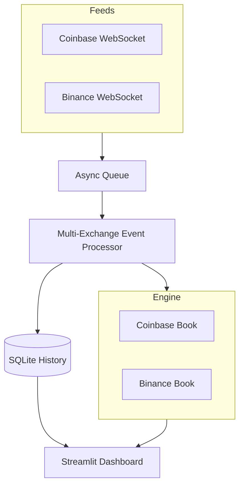

# Cross-Exchange Liquidity Engine

A high-performance, real-time cryptocurrency order book engine that aggregates liquidity from **Coinbase** and **Binance**. Built with Python, `asyncio`, and `websockets` for sub-100ms data ingestion.

## 🚀 Level 3 — Analytics & Alerts (Current)

The engine has graduated to include deep history, trend visualization, and real-time arbitrage alerting.

### Dashboard Overview (Level 3)

*Real-time Arbitrage Trend Charting & Alert Settings*


*Dual-Exchange Order Book Depth & Market Metrics*

### Key Features

- **Multi-Exchange Sync** — Simultaneous streaming from Coinbase Advanced Trade and Binance (Global/US fallback).
- **Arbitrage Trend Charting** — Live visual tracking of price gaps across the last 50 data points.
- **SQLite Persistence** — High-frequency logging (WAL-mode) of market conditions for historical analysis.
- **Smart Alerts** — User-defined thresholds with visual highlighting for one-click opportunity detection.
- **Global Best Price** — Aggregated best bid/ask and unified spread calculation.
- **Automatic Symbol Mapping** — Handles exchange-specific naming conventions (e.g., BTC-USD vs btcusdt).

---

## 📊 Level 2 — Multi-Exchange Comparison


*Direct side-by-side comparison of exchange liquidity and spreads.*

### Architecture



### Quick Start

```bash
# Install dependencies
pip install -r requirements.txt

# Run the dashboard
python -m streamlit run app.py

# Run tests
pytest tests/ -v
```

### Project Structure

```
├── app.py                      # Streamlit entry point (sidebar + dashboard)
├── requirements.txt            # Dependencies
├── data/                       # SQLite History DB
├── assets/                     # Screenshots & Images
├── src/
│   ├── engine/
│   │   ├── order_book.py       # Thread-safe OrderBook class
│   │   └── history_manager.py  # SQLite Persistence Manager
│   ├── feed/
│   │   ├── coinbase_feed.py    # Coinbase WebSocket listener
│   │   └── binance_feed.py     # Binance WebSocket listener (Global/US)
│   └── processor/
│       └── event_processor.py  # Async event routing & throttling
└── tests/
    └── test_order_book.py      # Unit tests
```

### Tech Stack

| Component | Technology |
|-----------|-----------|
| Language | Python 3.10+ |
| WebSocket | `websockets` library |
| Database | SQLite (WAL-Mode) |
| State Engine | Thread-safe Python (dict + Lock) |
| Queue | `asyncio.Queue` (in-process) |
| Dashboard | Streamlit + custom HTML/CSS |
| Tests | pytest |

### No API Key Required

The Coinbase and Binance Public WebSocket endpoints support unauthenticated subscriptions for market data. No API key or account needed.
